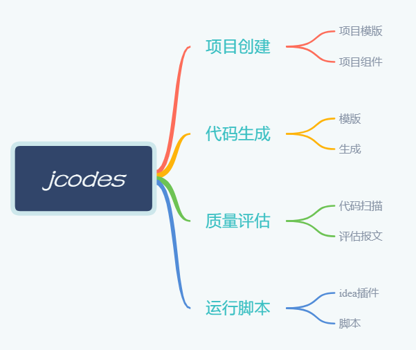
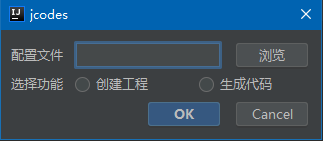

# jcodes

## 介绍
代码生成工厂

## 软件架构




## 软件依赖

1. beetl（模版生成）
2. jdbc（获取数据库连接）
3. snakeyaml（配置文件）

## 源码使用说明

1. 配置codes.yml,配置样例

```
#作者
author: xxx
#生成项目配置
project:
    #生成的项目目标目录
    baseDir: D:\codes\test
    #项目配置文件的来源目录
    config: D:\lvji_git\jcodes\config
    #模板文件的来源目录
    template: D:\lvji_git\jcodes\templates
    #项目名
    name: lvji-codes-test
    #坐标
    groupId: cn.lvji
    #版本号
    version: 1.0
    #模块
    module: pay
#生成业务代码配置
template:
    #模板文件的来源目录,请注意分隔符必须是反斜杠
    dir: D:\lvji_git\jcodes\templates\java\guide
    #生成的代码目标目录
    outPath: D:\codes\test\out
    #包名
    basePackage: cn.lvji.order
    #需要生成的业务表
    tables:
        - xxx
        - xxx
    prefixes: eo_
    #添加自己个性的key
    keys:
        module: zzx
        day: abc
#数据库配置
db:
    userName: xxx
    password: xxx
    database: xxx
    url: jdbc:mysql://192.168.32.88:3306/xxx?autoReconnect=true&useUnicode=true&characterEncoding=utf8&zeroDateTimeBehavior=convertToNull&serverTimezone=UTC
    driverClass: com.mysql.cj.jdbc.Driver
```

上面配置可能会觉得很复杂，一般我们只使用生成代码的就可以使用如下配置即可：
```
author: xxx
template:
  dir: D:\lvji_git\jcodes\templates\java\garden
  outPath: D:\codes\test\out
  basePackage: cn.lvji.order.garden
  tables:
    - t_distributor
    - t_dms_order_title
    - t_dms_order_title_view
    - t_order_stat
  prefixes: t_

db:
  userName: xxx
  password: xxx
  database: xxx
  url: jdbc:mysql://192.168.32.88:3306/batch?autoReconnect=true&useUnicode=true&characterEncoding=utf8&zeroDateTimeBehavior=convertToNull&serverTimezone=UTC
  driverClass: com.mysql.cj.jdbc.Driver

```

2. 配置模版文件，项目中有模版文件样例，在templates/java/guide目录下
3. 运行Bootstrap类

## 脚本使用说明

```
参数：
    p pj    （创建项目）
    p code  （生产代码）
    d       （删除代码）
示例：	  
./jcodes.bat p pj
./jcodes.sh p code
```

1. windows系统下运行bin/jcodes.bat p pj
2. linux系统下运行bin/jcodes.sh p pj

## idea插件使用说明

1. 自己打包生成idea安装包：
```
:jcodes-intellij-plugin:clean buildPlugn
```
在build/distributions/下找到zip安装包
2. idea plugins marketplace搜索jcodes安装
2. ALT+S快捷键或对应选项卡界面选中运行jcodes插件



3. 下载source下的模版文件，修改codes.yml，点击生成代码
